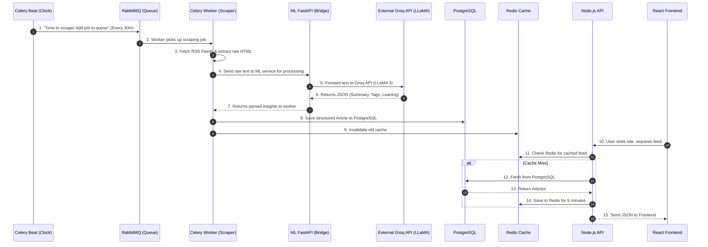
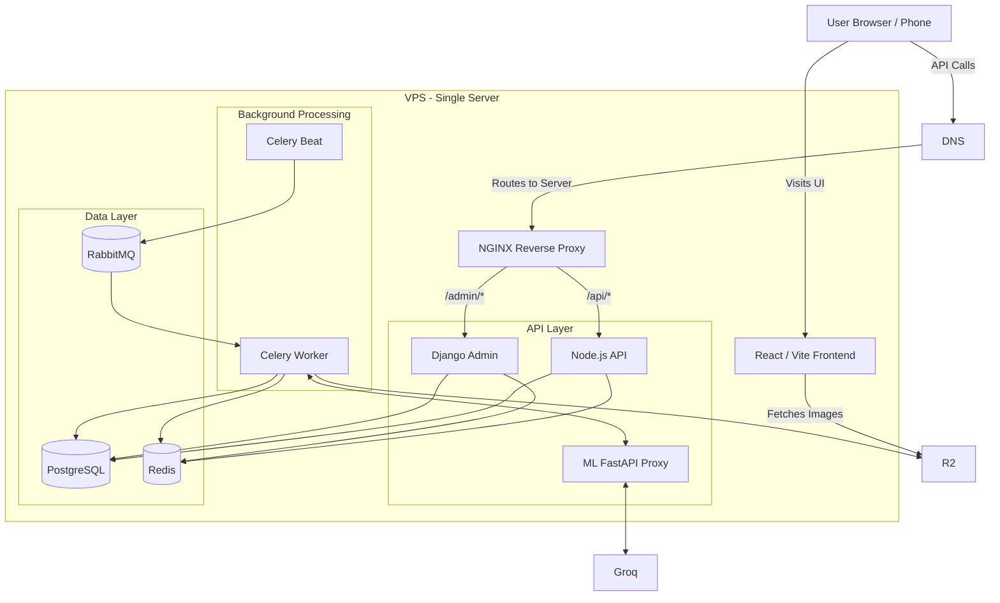

# 🚀 News Aggregator — Complete Architecture & Flow

Because you are using **Groq (LLaMA)** for your ML summarization instead of running heavy ML models locally, your server requirements drop dramatically! Your `ml-fastapi` container is simply acting as a lightweight bridge to the Groq API (or uses simple keyword extraction fallback). 

This means **you can comfortably run this entire backend on a cheap $6/month 4GB VPS** with zero out-of-memory crashes.

Below is the complete documentation of your data flow, architecture, and deployment costs.

---

## 1. Local Setup Data Flow (How it actually works)

This diagram shows what happens under the hood when your system fetches news, processes it, and serves it to users.

---

## 2. Proposed Deployment Architecture

This diagram maps out where everything lives in the real world when deployed.

---

## 3. Server Sizing & Cost Breakdown

Because all the heavy AI processing is offloaded to Groq's external servers (or handled by lightweight fallback logic), your VPS only handles networking, basic data storage, and Python/Node processes.

### Recommended Server Specs
* **Provider:** Hetzner Cloud
* **Instance:** CX22
* **OS:** Ubuntu 24.04 LTS
* **Specs:** 2 vCPU, 4GB RAM, 40GB NVMe SSD
* **Monthly Cost:** ~$3.50 to $6.00 / month (depending on region)

### Resource Usage Breakdown (4GB RAM Limit)
Here is how your 4GB of RAM will be distributed among your Docker containers:
* **Operating System (Ubuntu):** ~500 MB
* **PostgreSQL:** ~500 MB
* **RabbitMQ & Redis:** ~300 MB
* **Django Admin & Node API:** ~400 MB
* **Celery Workers (Scrapers):** ~500 MB
* **ML FastAPI (Proxy only):** ~100 MB
* **Total Usage:** **~2.3 GB / 4.0 GB**
* **Verdict:** You have plenty of safe overhead!

### Total Platform Pricing

| Service | Provider | Purpose | Monthly Cost |
| :--- | :--- | :--- | :--- |
| **Frontend Hosting** | VPS Container | React static bundle served via NGINX | **$0.00** |
| **AI Summarization** | Groq API | Processes news via LLaMA | **$0.00** *(Generous Free Tier)* |
| **Image Storage** | Cloudflare R2 | Serves article thumbnails | **$0.00** *(First 10GB free, $0 bandwidth)* |
| **Domain Routing** | Cloudflare | DNS + SSL | **~$0.80** *($10/year)* |
| **Backend & Frontend** | Hetzner CX22 | Runs all 9 Docker containers | **~$6.00** |
| **Total Startup Cost** | | | **~$6.80 / month** |

---

## 4. Why This Single-Server Architecture is Bulletproof

1. **Simplified Deployment:** By putting the Frontend and Backend on a single VPS, everything spins up instantly with one `docker-compose up -d --build` command. You don't have to manage multiple deployment platforms.
2. **AI Delegation:** By using Groq API instead of running local PyTorch models, your CPU and RAM requirements drop by over 80%.
3. **Database Speed:** By keeping PostgreSQL, Redis, Node, and Django all in the same Docker network on the same Hetzner server, they communicate via local sockets (0.1ms latency). If you used an external DB (like Neon), every database query would take 50ms+.
