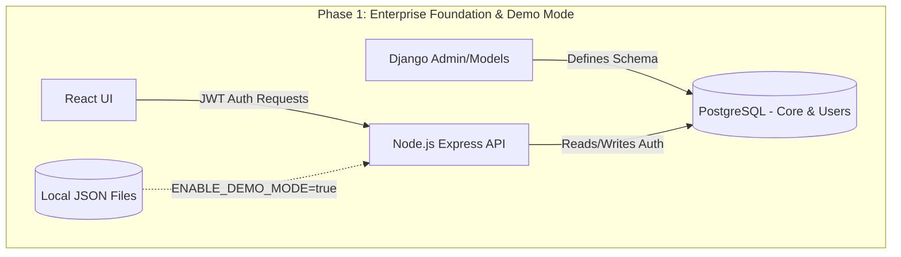
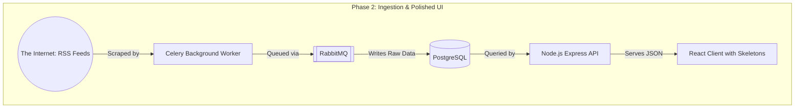
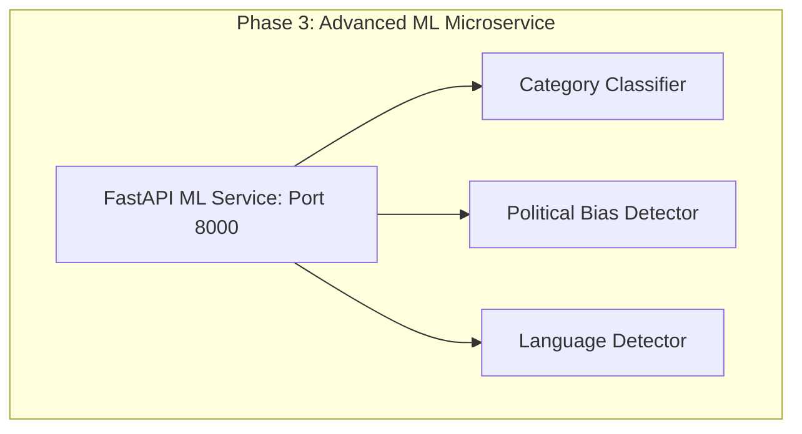
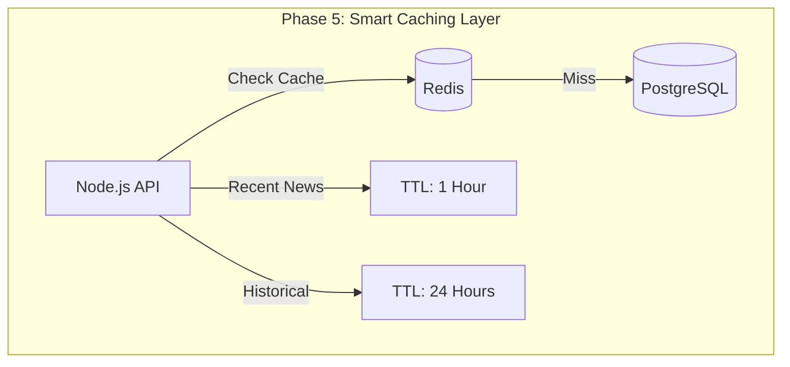
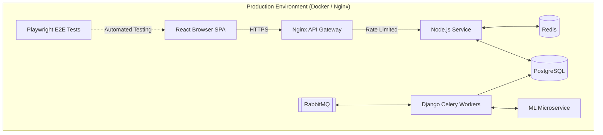

# News Aggregator: Enterprise Master Blueprint & Architecture Guide

This document is the complete 21-day enterprise master plan. It combines **System Architecture Diagrams** (showing how the system evolves) with **Concrete Code Examples** (showing exactly what each team member needs to write). We have incorporated enterprise-level standards including **State Management**, **Authentication/Authorization**, **Message Queues**, **Demo Mode Development**, and **Smart TTL Caching**.

This is designed to be read top-to-bottom. *(Note: If your Markdown viewer supports Mermaid, the architecture blocks will render as diagrams).*

---

## Phase 1: Foundation, Identity & Demo Mode (Days 1-3)
**Objective:** Define the core database schema, set up IAM (JWT, OAuth 2.0), and implement the **Demo Mode Pattern** so interns can work offline with pre-cached JSON files immediately.

### Evolving Architecture (Phase 1)


### Team Tasks & Examples
*   **Django (Intern 1):** Define Postgres Tables including extended metadata (Language, Political Leaning).
*   **Node.js (Intern 2):** Create Auth workflows and implement Demo Mode toggle.
    ```javascript
    // services/news.service.js
    const getArticles = async () => {
        if (process.env.ENABLE_DEMO_MODE === 'true') {
            return require('../demo-data/articles.json'); // Instant offline dev
        }
        return await prisma.article.findMany();
    };
    ```
*   **React (Intern 3):** Setup UI with **Dark Mode** support and CSS variables. Implement State Management (Zustand).

---

## Phase 2: Ingestion Engine & UI Polish (Days 4-6)
**Objective:** Background web scraping via RabbitMQ/Celery. Frontend implements polished UX with Skeleton Loaders and Grid/List views.

### Evolving Architecture (Phase 2)


### Team Tasks & Examples
*   **React (Intern 3):** Implement Skeleton Loaders and Grid/List toggle in the UI. Use React Query for fetching.
*   **Django (Intern 1):** Write RSS scraper utilizing RabbitMQ for durable task queueing.

---

## Phase 3: Advanced ML Scaffolding (Days 7-9)
**Objective:** Add FastAPI microservice. The ML model now classifies Categories, **Languages**, and **Political Leaning**.

### Evolving Architecture (Phase 3)


### Team Tasks & Examples
*   **Machine Learning (Intern 4):** Build endpoints that output rich metadata for advanced filtering.
*   **Node.js (Intern 2):** Ensure API routes accept advanced filter queries (e.g., `?leaning=left&lang=en`).

---

## Phase 4: Enterprise Integration Pipeline (Days 10-12)
**Objective:** Orchestrate data flow from Scraper -> ML Service -> DB via RabbitMQ. Add complex Boolean Search logic.

### Team Tasks & Examples
*   **Node.js (Intern 2):** Implement Boolean Search (AND/OR/NOT) in the Postgres queries.
    ```javascript
    // Allow queries like "technology AND (AI OR Robotics) NOT crypto"
    const articles = await queryBuilder.applyBooleanSearch(req.query.q);
    ```

---

## Phase 5: Smart Caching Strategy (Days 13-15)
**Objective:** Introduce Redis with dynamic TTLs (1 hour for recent news, 24 hours for historical) to minimize DB load.

### Evolving Architecture (Phase 5)


### Team Tasks & Examples
*   **Node.js (Intern 2):** Implement dynamic Redis TTL middleware.
    ```javascript
    const ttl = isRecentNews(data) ? 3600 : 86400; // 1hr vs 24hr
    redis.setex(cacheKey, ttl, JSON.stringify(data));
    ```

---

## Phase 6: Extractive Summarization & Personalization (Days 16-18)
**Objective:** Add Extractive Summarization via ML and personalized feeds based on user state.

---

## Phase 7: Production Orchestration & E2E Testing (Days 19-21)
**Objective:** Nginx API Gateway, Docker deployment, and rigorous End-to-End (E2E) testing using Playwright.

### Final Production Architecture (Phase 7)


### Team Tasks & Examples
*   **All Interns:** Write Playwright E2E tests simulating real user flows (login, filter, read).
    ```typescript
    // e2e/news-feed.spec.ts
    test('user can filter by political leaning', async ({ page }) => {
      await page.goto('/');
      await page.click('text=Filters');
      await page.check('text=Center-Left');
      await expect(page.locator('.article-card')).toHaveCount(10);
    });
    ```
